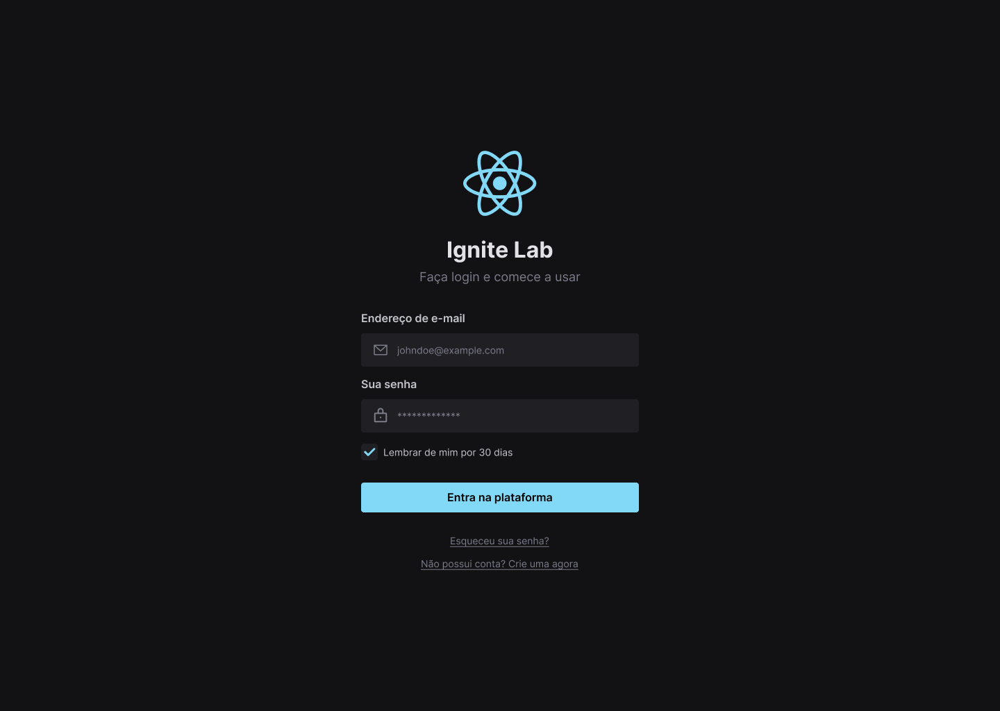
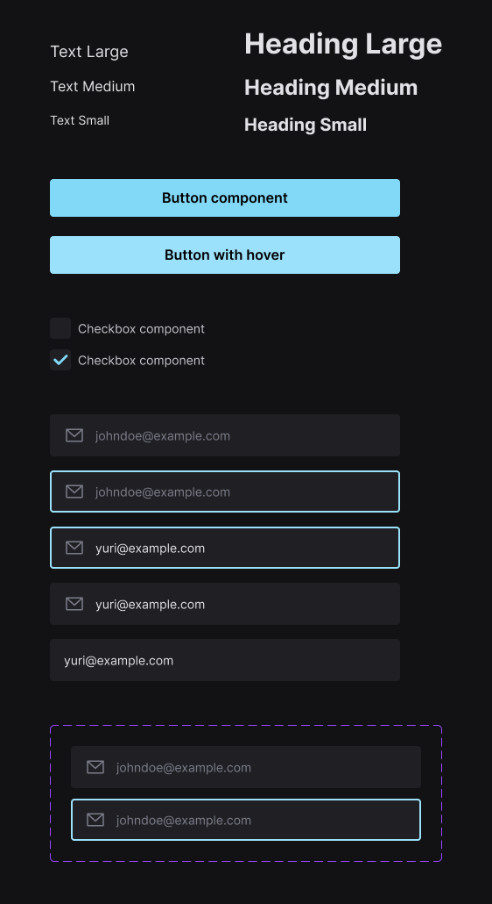

<h1 align="center">
  
</h1>

<h4 align="center">
  Ignite Lab Design System - Concluded 🚀
</h4>

<p align="center">
 <a href="#-about-the-project">About</a> •
 <a href="#-functionalities">Functionalities</a> •
 <a href="#-layout">Layout</a> •
 <a href="#-how-to-run-the-project">How to run</a> •
 <a href="#-technologies">Technologies</a> •
 <a href="#-author">Author</a> •
 <a href="#user-content--license">License</a>
</p>

## 💻 About the project

Project in ReactJS developed with Vitejs.
Design System project that provides visual components for creation of interfaces.

Project developed during the **NLW (Next Level Week)** taught by [Rocketseat](https://www.rocketseat.com.br/). The NLW is an online experience with a lot of practical content, challenges and hacks where the content is available for one week.

---

## ⚙️ Functionalities

- [x] Users can:
  - [x] Browse and interact with the different reusable components available.

---

## 🎨 Layout

The application layout is available in Figma:

<a href="https://www.figma.com/file/cLl4OGQuEcmIegDTMyzh2S/Ignite-Lab-Design-System">
  
</a>

### Web

<div style="display: flex; flex-direction: column; align-items: center; justify-content: center; gap: 10px">
  
</div>

---

## 🚀 How to run the project

This is a frontend project.

### Prerequisites

Before starting, you will need to have the following tools installed on your machine:
[Git](https://git-scm.com), [Node.js](https://nodejs.org/en/)(Node.js version 16.14.2 is ideal).
Also it's nice to have an editor to work with the code like [VSCode](https://code.visualstudio.com/).

#### 🧭 Running the web application (Frontend)

```bash

# Clone this repository
$ git clone git@github.com:yuricavalini/ignite-lab-design-system.git

# Access the project folder in your terminal/cmd
$ cd ignite-lab-design-system

# Install the dependencies
$ npm install

# Open a terminal and run the server in development mode
$ npm run dev

# The application will open on port:5173 - go to http://localhost:5173

# Open another terminal and run the server in development mode
$ npm run storybook

# The application will open on port:6006 - go to http://localhost:6006

# Open another terminal and run the server in development mode
$ npm run test-storybook

# The test result will be shown in the terminal

```

---

## 🛠 Technologies

Main tools used in the construction of the project:

#### **Website**  ([React](https://reactjs.org/)  +  [TypeScript](https://www.typescriptlang.org/))

- **[Phosphor-React](https://github.com/phosphor-icons/react)**
- **[Axios](https://axios-http.com/)**
- **[Radix-UI](https://www.radix-ui.com/)**
- **[Clsx](https://github.com/lukeed/clsx)**
- **[PostCSS](https://postcss.org/)**
- **[TailwindCSS](https://tailwindcss.com/)**
- **[Storybook](https://storybook.js.org/)**
- **[Jest](https://jestjs.io/)**
- **[Testing-Library](https://testing-library.com/)**
- **[MSW](https://mswjs.io/)**

> See the full file [package.json](https://github.com/yuricavalini/ignite-lab-design-system/blob/master/package.json)

**Utilities**

- Prototype:  **[Figma](https://www.figma.com/)**  →  **[Prototype (Ignite-Lab-Desing-System)](https://www.figma.com/file/cLl4OGQuEcmIegDTMyzh2S/Ignite-Lab-Design-System)**
- Standardization of project and code: **[Eslint](https://eslint.org/)** - **[Commit-msg-linter](https://github.com/legend80s/commit-msg-linter)** - **[Husky](https://typicode.github.io/husky/#/)** - **[Lint-staged](https://github.com/okonet/lint-staged)** - **[EditorConfig](https://editorconfig.org/)**
- Editor:  **[Visual Studio Code](https://code.visualstudio.com/)**

---

## 🧑🏻‍💻 Author

<div align="center">
  <a href="https://github.com/yuricavalini">
  
  <br />
  <sub><b>Yuri Cavalini</b></sub></a> <a href="https://github.com/yuricavalini" title="Yuri Cavalini">🚀</a>
  <br />
  </a>
</div>
<br />
<div align="center">
  <a title="yuricavalini@gmail.com" href="mailto:yuricavalini@gmail.com?subject=Contact" target="_blank">
    
  </a>
  <a href="https://discordapp.com/users/9585" target="_blank">
    
  </a>
  <a href="https://linkedin.com/in/yuricavalini" target="_blank">
    
  </a>
</div>

---

## 📝 License

This project is licensed under the [MIT](./LICENSE) license.

Made with ❤️ by Yuri Cavalini 👋🏻 [Contact me!](https://www.linkedin.com/in/yuricavalini/)
